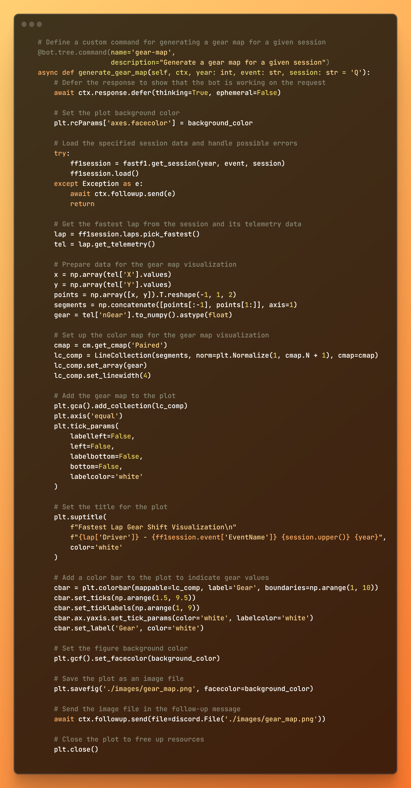

# KC Discord Bot


## Table of Contents
- [Overview](#overview)
- [Features](#features)
- [Commands](#commands)
  - [Music](#music)
  - [Image Generation](#image-generation)
  - [Text-to-Speech Conversations](#text-to-speech-conversations)
  - [Text-to-Text Conversations](#text-to-text-conversations)
  - [F1 Related](#f1-related)
  - [Weather](#weather)
- [Dependencies](#dependencies)
- [Getting Started](#getting-started)
- [Usage](#usage)

## Overview
#### This repository hosts the source code for the KC Discord bot, alongside the Lilith variant and a Ferrari-themed F1 data bot. KC is developed using Python 3.11 and integrates several libraries and APIs to provide an engaging and feature-rich experience.

## Features

- ### Engages in text-to-text conversations using OpenAI's GPT-3.5 Turbo, retaining the last 10 messages in the channel


- ### Generates text-to-speech audio from text-to-text conversations using the ElevenLabs API


- ### Generates images with Stability.AI's Stable Diffusion and OpenAI's Dall-E models


- ### F1 telemetry analysis using Fast-F1


### KC also features a music player, weather information, and more!

## Commands
### F1 Related
```
/data-dump - Generates a data dump for a given year, event, session, and optionally a specific lap in .CSV format
/driver-comparison - Compares two driver's telemetry given a year, event, session, and optionally a specific lap
/gear-map - Generates a gear map for a given year, event, session, and optionally a specific lap
/strat - Generates a meme Ferrari strategy
/year-vs-year - Compares telemetry between two years for a given event and session
```
### Image Generation
```
/dall-e - Generates an image using OpenAI's Dall-E API using a given prompt
/stable - Generates an image using Stability.AI's Stable Diffusion API using a given prompt, and 5 optional parameters
```
### Music
```
/clear - Clears the current queue
/leave - Leaves the voice channel
/pause - Pauses the current song
/play [url]/<search terms> - Plays music from a YouTube URL or search terms
/queue - Displays the current queue
/resume - Resumes the current song
/skip - Skips the current song
```
### Text-to-Speech Conversations
```
/join - Joins the voice channel
/tts-kick - Kicks the bot from the voice channel
```
### Text-to-Text Conversations
```
/hype - Generates a hype emojipasta about a given prompt
```
### Weather
```
/weather - Displays the current weather for a given location
/outlook - Pulls the Day 1 convective outlook from the Storm Prediction Center
/radar-loop - Pulls the latest radar loop for the Mississippi Valley from the National Weather Service
/bmx-radar - Pulls the latest loop from the BMX radar from the National Weather Service
```


## Dependencies
To run the KC Discord bot, ensure you have the following packages installed:

```
setuptools==65.5.1 # not directly required, pinned by Snyk to avoid a vulnerability
discord.py==2.2.3
elevenlabslib==0.6.0
fastf1==3.0.0
icalendar==5.0.5
openai==0.27.6
Pillow==9.5.0
pyowm==3.3.0
PyNaCl==1.5.0
stability_sdk==0.7.0
supervisor==4.2.5
```


