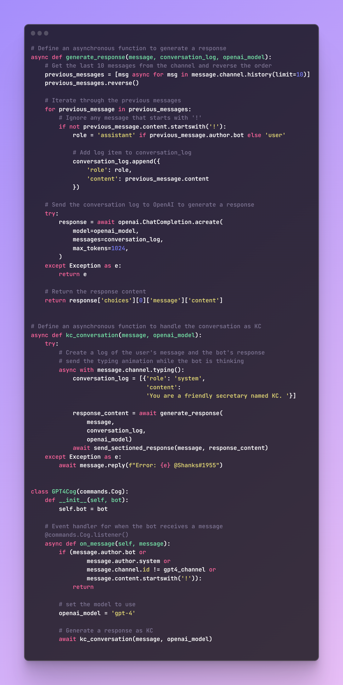

# KC Discord Bot


## Table of Contents
- [Overview](#overview)
- [Features](#features)
- [Commands](#commands)
  - [Music](#music)
  - [Image Generation](#image-generation)
  - [Text-to-Speech Conversations](#text-to-speech-conversations)
  - [Text-to-Text Conversations](#text-to-text-conversations)
- [Dependencies](#dependencies)
- [Getting Started](#getting-started)
- [Usage](#usage)

## Overview
#### This repository hosts the source code for the KC Discord bot, alongside the Lilith variant and a Ferrari strategy generator bot. KC is developed using Python 3.10 and integrates several libraries and APIs to provide an engaging and feature-rich experience.

## Features

- ### Engages in text-to-text conversations using OpenAI's GPT-3.5 Turbo, retaining the last 10 messages in the channel


- ### Generates text-to-speech audio from text-to-text conversations using the ElevenLabs API


- ### Generates images with Stability.AI's Stable Diffusion and OpenAI's Dall-E models


### And it plays music from YouTube!

## Commands
### Music
```
/play [url]/<search terms> - Plays music from a YouTube URL or search terms
/skip - Skips the current song
/queue - Displays the current queue
/clear - Clears the current queue
/pause - Pauses the current song
/resume - Resumes the current song
/leave - Leaves the voice channel
```
### Image Generation
```
/dall-e - Generates an image using OpenAI's Dall-E API using a given prompt
/stable - Generates an image using Stability.AI's Stable Diffusion API using a given prompt, and 5 optional parameters
```

### Text-to-Speech Conversations
```
/join - Joins the voice channel
/tts-kick - Kicks the bot from the voice channel
```
### Text-to-Text Conversations
```
/hype - Generates a hype emojipasta about a given prompt
```

## Dependencies
To run the KC Discord bot, ensure you have the following packages installed:

```
OpenAI
discord.py
supervisor
PyNaCl
stability-sdk
Pillow
elevenlabslib
youtube-dl (from master branch!)
Fast-F1
numpy
pandas
matplotlib
```

## Getting Started
1. Clone the repository or download the source code.
2. Install the required dependencies as listed in the Dependencies section.
3. Obtain necessary API keys and tokens for OpenAI, Stability.AI, ElevenLabs, and Discord.
4. Update the configuration files with the obtained keys and tokens.
5. Follow the usage instructions below to run the bot.

## Usage
To run the KC Discord bot, simply run the following command:

#### Windows
```
py -3.10 kc.py
```

#### Linux
```
python3.10 kc.py
```

#### Docker
```
sudo docker run warshanks/discord-bots:latest
```

